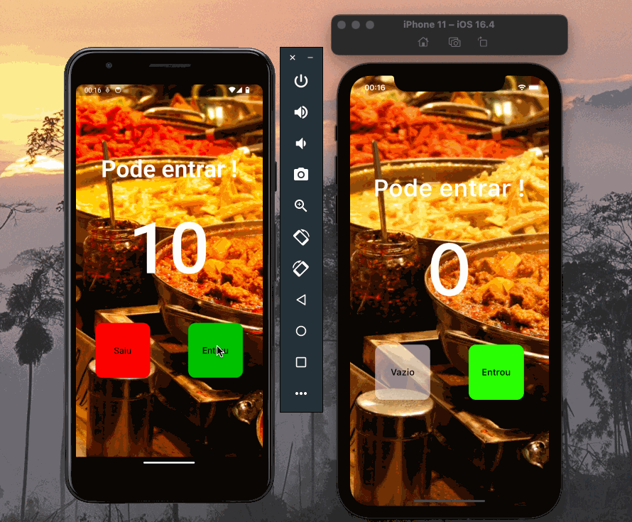

# Aplicativo de contagem para Restaurante (Flutter).

  

    
  

## Pontos Trabalhados 
- Logica de programação
- Gerenciamento de tela
- StatelessWidget e StatefulWidget
- Tratamento de Erros
- Responsividade

# ⚠️ OBS:

Para rodar aplicações flutter, certifique-se se sua máquina possui as seguintes tecnologias.

